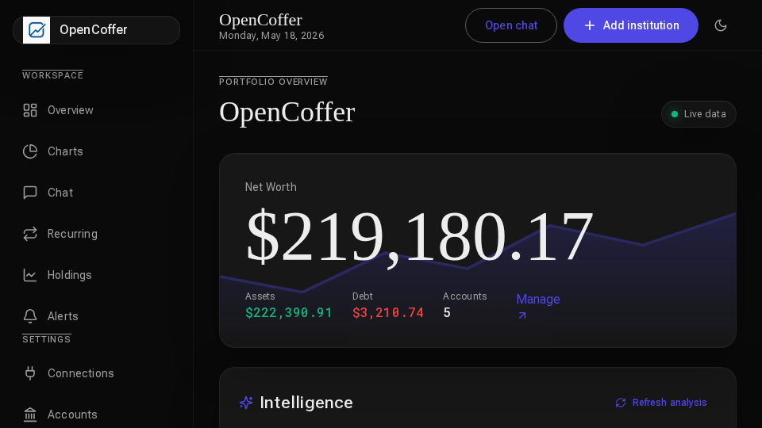
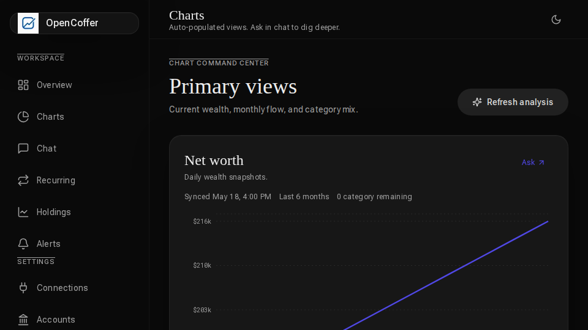
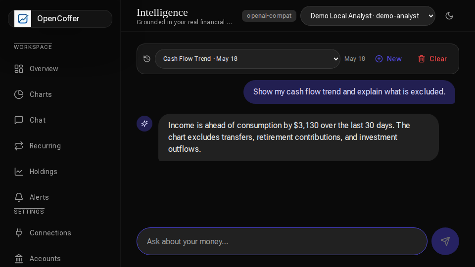

<div align="center">


# OpenCoffer

**Self-hosted personal finance with bank sync, dashboards, and a BYO-LLM chat that actually reads your numbers.**

[](LICENSE)
[](https://nextjs.org/)
[](https://www.postgresql.org/)
[](https://docs.docker.com/compose/)
[](https://modelcontextprotocol.io/)

[Quick start](#-quick-start-docker) · [Features](#-features) · [MCP](#-mcp) · [Configuration](#%EF%B8%8F-configuration) · [Security](#-security)

</div>

<p align="center">
  
</p>

OpenCoffer is read-only against your financial accounts. It syncs through [SimpleFIN](https://www.simplefin.org/), stores everything in a Postgres database you own, encrypts sensitive tokens and model keys at rest, and lets you ask finance questions through the in-app chat or any MCP-compatible client. Bring any model you want — OpenAI, Anthropic, OpenRouter, Groq, Together, Ollama, Hermes, ChatGPT subscription auth, or any OpenAI-compatible endpoint.

---

## Features

- **Bank & brokerage sync** via SimpleFIN — one-token setup, encrypted access URLs.
- **Net worth, cash flow, spending, subscriptions, holdings, budgets, alerts, saved charts** — all deterministic, all generated from your database.
- **Bring your own LLM** — OpenAI, Anthropic, any OpenAI-compatible provider, ChatGPT subscription auth, local Ollama, or a self-hosted endpoint.
- **Persistent chat with finance tools** — model picker, conversation history, category fixes, deterministic chart tools the LLM can call.
- **Background worker** — automatic sync, categorization, insight refresh, and net-worth snapshots on a cron you control.
- **MCP server** at `/api/mcp` exposing the same finance tools used by chat, so any MCP client (Claude Desktop, Hermes, custom agents) can query your data with a bearer token.
- **Docker Compose** deployment with Postgres, web, worker, and optional Ollama.

## Screenshots

<table>
  <tr>
    <td align="center"><br/><sub><b>Overview</b> — net worth, cash flow, intelligence</sub></td>
    <td align="center"><br/><sub><b>Charts</b> — deterministic, regenerated on sync</sub></td>
    <td align="center"><br/><sub><b>Chat</b> — BYO model, persistent history</sub></td>
  </tr>
</table>

## Quick start (Docker)

The fastest path — Postgres, web, and worker running in three commands.

```bash
# 1. Generate secrets
cp .env.example .env
echo "NEXTAUTH_SECRET=$(openssl rand -base64 32)" >> .env
echo "APP_ENCRYPTION_KEY=$(openssl rand -base64 32)" >> .env

# 2. Start Postgres, run migrations, then bring up the full stack
docker compose up -d postgres
docker compose run --rm web pnpm db:migrate
docker compose up -d --build
```

Open <http://localhost:3000>, create an account, then add a SimpleFIN setup token in **Settings → Connections**.

> [!IMPORTANT]
> `APP_ENCRYPTION_KEY` encrypts your SimpleFIN access URLs and LLM API keys at rest. **Back it up.** Rotating it makes existing encrypted secrets unreadable.

## Local development

Requirements: **Node.js 22**, **pnpm** (via Corepack), **Postgres 16+**.

```bash
corepack enable
pnpm install
cp .env.example .env.local

# Point DATABASE_URL at your local Postgres, then:
pnpm db:migrate
pnpm dev          # web on :3000
pnpm worker       # background sync + categorization (second terminal)
```

For production-mode testing (recommended for mobile / LAN testing — `next dev` compiles on demand and is slow over the network):

```bash
pnpm build
pnpm start
pnpm worker
```

## Architecture

```
┌──────────────┐     ┌──────────────┐     ┌──────────────┐
│   Next.js    │     │  Postgres 16 │     │   Worker     │
│   (web)      │◄───►│  (drizzle)   │◄───►│   (cron)     │
│              │     │              │     │              │
│  /dashboard  │     │  accounts    │     │  • sync      │
│  /chat       │     │  txns        │     │  • categorize│
│  /settings   │     │  insights    │     │  • insights  │
│  /api/mcp ───┼──┐  │  snapshots   │     │  • snapshots │
└──────────────┘  │  │  budgets     │     └──────┬───────┘
                  │  │  chat_msgs   │            │
                  │  │  llm_creds*  │            │
                  │  │  mcp_tokens* │            ▼
                  │  └──────────────┘     ┌──────────────┐
                  │                       │  SimpleFIN   │
                  ▼                       │   bridge     │
         ┌─────────────────┐              └──────────────┘
         │   MCP client    │
         │  (Claude /      │     * encrypted with
         │   Hermes / etc) │       APP_ENCRYPTION_KEY
         └─────────────────┘
```

The **worker is part of the release runtime, not optional dev tooling.** It syncs SimpleFIN connections, categorizes new transactions with your chosen analysis model, refreshes AI insights, writes net-worth snapshots, and purges disconnected connections after their retention window.

## Configuration

All configuration lives in `.env` (Docker) or `.env.local` (dev). See [`.env.example`](.env.example) for the full list.

| Variable | Required | Description |
| --- | :---: | --- |
| `DATABASE_URL` | Yes | Postgres connection string |
| `NEXTAUTH_SECRET` | Yes | Auth.js session secret — `openssl rand -base64 32` |
| `NEXTAUTH_URL` | Yes | Public URL of the web app |
| `APP_ENCRYPTION_KEY` | Yes | 32-byte base64 key for at-rest encryption of secrets |
| `APP_URL` | Yes | Used in MCP setup snippets shown in the UI |
| `OPENCOFFER_SYNC_CRON` | No | Worker sync cadence (default `*/30 * * * *`) |
| `OLLAMA_BASE_URL` | No | Pre-seeded base URL when using the bundled Ollama profile |

### LLM setup

1. Open **Settings → Models**.
2. Add at least one credential. Any OpenAI-compatible endpoint works — provider, base URL, API key, model name.
3. Mark one model as the **analysis model**. It's used for background categorization and generated insights. Chat lets you pick per-message.

To run Ollama inside the compose network:

```bash
docker compose --profile ollama up -d ollama
```

Then point the app at `http://ollama:11434/v1` (inside Docker) or `http://host.docker.internal:11434/v1` (host Ollama from a container).

### SimpleFIN

OpenCoffer uses [SimpleFIN](https://www.simplefin.org/) for read-only bank and brokerage data. There are no app-wide credentials — each user pastes their own setup token in **Settings → Connections**. The token is claimed once; the resulting access URL is encrypted with `APP_ENCRYPTION_KEY`.

Disconnecting a connection marks it for purge after 30 days. Hard-delete removes it immediately.

## MCP

OpenCoffer exposes its finance tools to MCP-compatible clients at `/api/mcp`.

```bash
# 1. Create a token in Settings → MCP
# 2. Wire it into your MCP client (Hermes example):

hermes mcp add opencoffer \
  --transport http \
  --url http://localhost:3000/api/mcp \
  --header "Authorization: Bearer oc_<your-token>"
```

Tool families available over MCP:

```
accounts            recent_transactions    transaction_search
spending_by_category  holdings             recurring_streams
upcoming_payments   net_worth              budgets
alerts              chart_data             category_fixes
```

The LLM writes the commentary; finance totals come from deterministic database-backed tools. No hallucinated balances.

## Security

- SimpleFIN access URLs and LLM API keys are encrypted at rest with `APP_ENCRYPTION_KEY`.
- MCP bearer tokens are stored as hashes — you see them once at creation.
- Dashboard and settings routes require Auth.js sessions; `/api/mcp` uses bearer auth instead of session cookies.
- Keep `NEXTAUTH_SECRET`, `APP_ENCRYPTION_KEY`, `.env`, database backups, and SimpleFIN setup/access URLs private.

See [SECURITY.md](SECURITY.md) for the full policy and disclosure channel.

## Operations

```bash
docker compose logs -f web
docker compose logs -f worker
docker compose run --rm web pnpm db:migrate    # apply new migrations
docker compose pull && docker compose up --build -d
```

Back up Postgres before upgrades:

```bash
docker compose exec postgres pg_dump -U opencoffer opencoffer > opencoffer.sql
docker compose exec -T postgres psql -U opencoffer opencoffer < opencoffer.sql
```

## Demo GIF

The hero GIF lives at [`public/demo.gif`](public/demo.gif). It's rendered from real app screenshots captured with fake demo data — never real account data.

```bash
# Remotion source (preferred — produces the higher-res GIF)
cd demo/remotion
pnpm install
pnpm run render:gif      # writes ../../public/demo.gif

# Deterministic Python fallback (no Remotion / Chromium required)
python3 scripts/generate-demo-gif.py
```

## Contributing

PRs welcome. See [CONTRIBUTING.md](CONTRIBUTING.md) for the local setup and the checks that should pass before opening a PR:

```bash
npx --no-install tsc --noEmit
pnpm lint
pnpm build
```

## License

[MIT](LICENSE) © OpenCoffer contributors.
